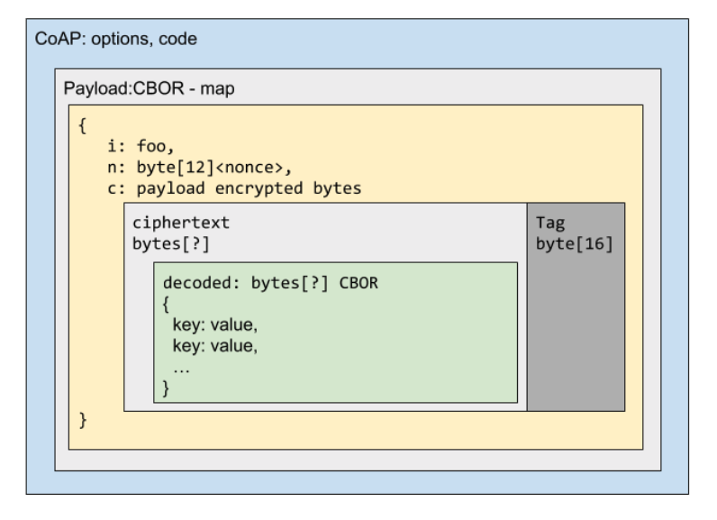

#Tiny end-end Crypto

This repo represents an experiment in small device security that is built on end-end encryption with no assumption of transport security or trusted chain of custody.

A challenge in many IoT system designs is that a data message may travel over many legs in its journey. Ensuring end-end security means ensuring a security model at each leg, which may not always be possible for reasons such as:

* msg is traveling over an RF protocol with no transport layer security
* msg is transiting an untrusted gateway, where MITM code can run.
* msg is transiting a 3rd party private network where network security is under control of the 3rd party (carrier networks).
* A protocol is used where securing the transport is difficult or awkward (eg DTLS with CoAP)

It is based on NIST P-256 [ECC](https://en.wikipedia.org/wiki/Elliptic-curve_cryptography) as it is standard, though this could be switched to use Curve25519 if you are [spooked](http://ogryb.blogspot.com/2014/11/why-i-dont-trust-nist-p-256.html).  ECC allows for fast cryptography on small devices with well known primitives.

Message content is sent with [AEAD](https://en.wikipedia.org/wiki/Authenticated_encryption#Authenticated_encryption_with_associated_data) using [ChaCha20](https://en.wikipedia.org/wiki/Salsa20#ChaCha_variant)/[Poly1305](https://en.wikipedia.org/wiki/Poly1305).
AEAD ensures the receiver can trust who sent the message, and the additional data can help avoid server confusion in associating data with senders. 

The shared key is derived from EC keypairs for both sender and receiver using [ECDH](https://en.wikipedia.org/wiki/Elliptic-curve_Diffie%E2%80%93Hellman). This allows the sender and receiver to establish secure encryption without needing to exchange any secrets.

The unencrypted message is serialized into [CBOR](http://cbor.io/).  The Encrypted message is then included in an envelope message that includes the msg Nonce and the id of the sender.

> Note: The sender can be obscured at the cost of additional bytes in the envelope, by using an ephemeral key for additional AEAD of the sender ID, and sending the public key in the envelope.

The MCU project is set up with https://platformio.org/ for a [Teensy 3.6](https://www.pjrc.com/store/teensy36.html), but should be usable with nearly any platform that supports the Arduino Framework in PlatformIO.

The embedded code uses [Micro-ECC](https://github.com/kmackay/micro-ecc) for ECDH and [Arduino Crypto lib](https://github.com/rweather/arduinolibs/tree/master/libraries/Crypto) for the AEAD.

Inside the server directory, is a sample golang program that:

1. Reads the full msg over serial
1. Decodes the CBOR envelope
1. Looks up the client public key
1. Decrypts the message
1. Decodes the inner message CBOR

> Note: you will need to be sure to set your serial device before running the go program

These messages could be further wrapped into a CoAP or MQTT message.

This project is for illustration only, and would need further review before using in production. The primitives themselves are well understood and tested, but crypto is always full of landmines. You need to ensure you have a good RNG source, you need to make sure private keys are being managed properly, and you need to establish how you register and trust device public keys.

Putting this together involves a pretty high HB:LOC (head bangs to lines of final code) ratio, since there is a relative lack of example about putting all these parts together, across platforms and languages.  There are additional snippets that show how to decode and work with these messages in Python and Node that may be added to this repo in the future.

